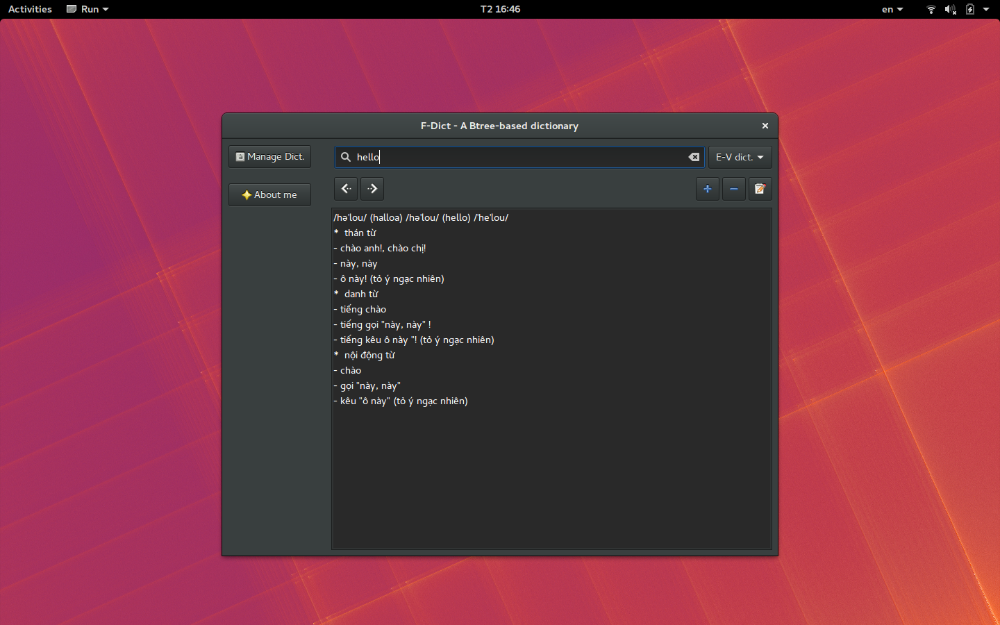
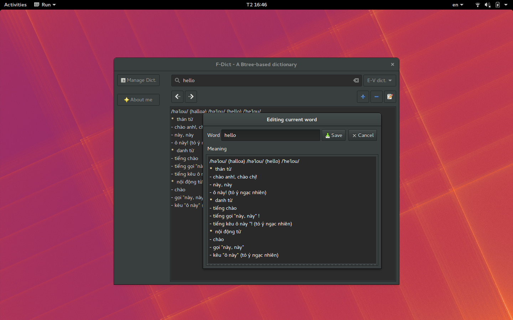
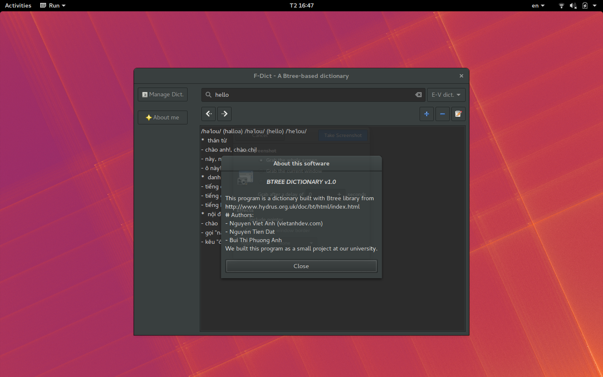
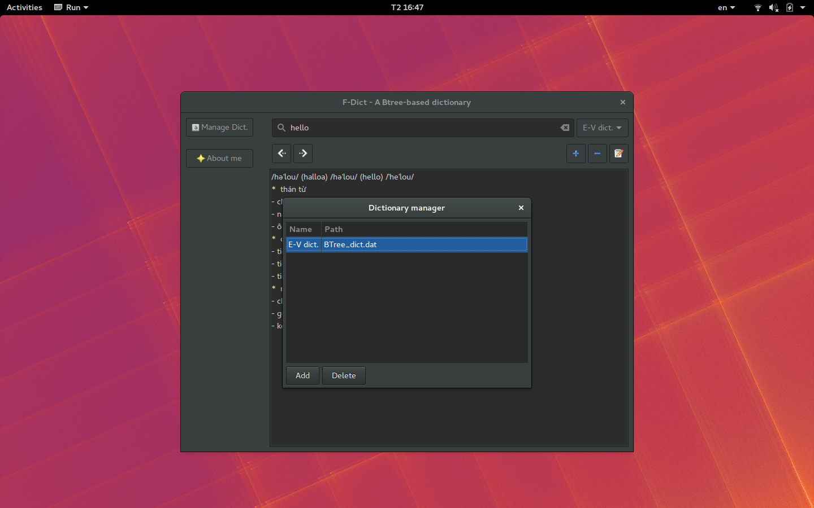

# BTree Dictionary

**Authors:** Viet Anh, Phuong Anh, Tien Dat


## Build:

- Run `init_btree_lib.sh` to compile Btree library.

- Build `run`:

```sh
make clean
make
```

## Screenshots:







